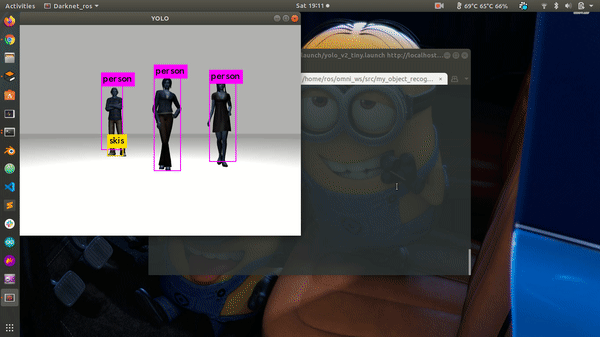

# darknet-ros-3D
This is a repo created for 2d and 3d object recognition and detection using yolo darknet ros packages 

### How to install:
1. `cd ~/catkin_ws/src`
2. `git clone https://github.com/shivam675/darknet-ros-3D.git`
3. `cd ~/catkin_ws`
4. `catkin_make -DCMAKE_BUILD_TYPE=Release darknet_ros`
5. `catkin_make -DCMAKE_BUILD_TYPE=Release gb_visual_detection_3d_msgs_generate_messages`
6. `catkin_make -DCMAKE_BUILD_TYPE=Release -j(nproc)`
7. `source devel/setup.bash`

## Try to build the ws if it fails for first time.

### How to run:

1. To open cam-bot in Gazebo | 
Terminal 1: 
	`roslaunch camera_sim cam.launch`

2. To open cam-bot in and initiate darknet   | 
Terminal 2: 
	`roslaunch my_object_recognition yolo_v2_tiny.launch`

3. To viz point-cloud in ros use | 
Terminal 3: 
	`roslaunch camera_sim viz.launch` 

# Results :

# Tested on System config:
- Hardware: Intel i3 dual-core qual-thread
- ROS: Melodic
- OS: Ubuntu 18.04 LTS
- 2-core AMD
- 8GB RAM

